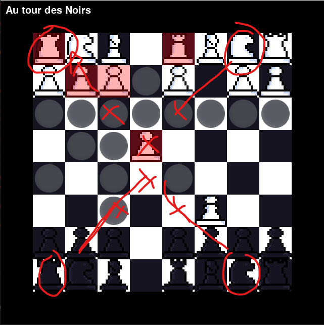

# A sample Chess game
## Developped by:
* [_ShorpAzha_ (programming)](https://github.com/ShorpAzha)
* [_Flond3_ (spriting)](https://github.com/Flond3)
## How to play
With left click you put the pion in your hand, with your right click, you put the pion on the plane.
## News features will come
- [x] All pions have a circle for show how to put the pion in the plane
- [ ] Put the dead pions in the left or right of the plane
- [ ] Multiplayer in local
- [x] A logic for win (or lose like me) the game lol
(Yes I've make it but I'm not a good chess player -_-)
## One bug sry it's WIP

> Sniff